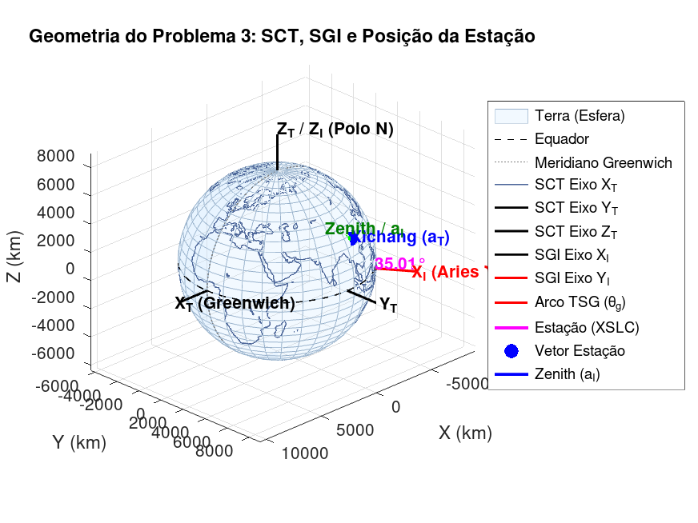
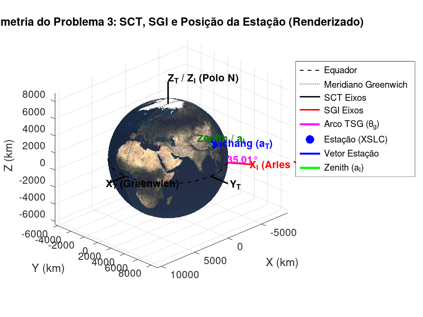

# Relatório de Modelagem e Simulação — Problema 3

**Curso:** Laboratório de Guiagem, Navegação e Controle de Veículos Espaciais  
**Aluno:** Shinmen  
**Tema:** Sistemas de Coordenadas e Tempo  

---

## 1. Introdução Teórica e Formulação Matemática

O objetivo deste trabalho é realizar a transformação de coordenadas de um vetor de posição $a$ de uma estação terrestre do sistema de coordenadas geográficas (latitude geodésica, longitude e altitude) para o referencial de coordenadas cartesianas terrestres fixo na Terra (SCT), e posteriormente para o referencial Geocêntrico Equatorial Inercial (SGI) no instante da medição: **20/06/2026 às 21h43m35.0s (U.T.)**.

### 1.1. Elipsoide de Referência
Adotou-se o elipsoide **WGS-84** para modelar o contorno da Terra, cujos parâmetros são:
*   Semieixo maior equatorial ($a_e$): $6378.137 \text{ km}$
*   Achatamento ($f$): $1 / 298.257223563$
*   Primeira excentricidade ao quadrado ($e^2$): $2f - f^2 \approx 0.00669437999014$

### 1.2. Transformação de Geográficas para SCT (Cartesianas Terrestres)
Dadas a latitude geodésica $\phi$, longitude $\lambda_E$ e altitude $H$, calculamos o raio de curvatura no primeiro vertical ($N$) e as coordenadas $x_T, y_T, z_T$:
$$N = \frac{a_e}{\sqrt{1 - e^2 \sin^2\phi}}$$
$$G_1 = N + H$$
$$G_2 = N(1 - f)^2 + H = N(1 - e^2) + H$$
$$a_T = \begin{bmatrix} x_T \\ y_T \\ z_T \end{bmatrix} = \begin{bmatrix} G_1 \cos\phi \cos\lambda_E \\ G_1 \cos\phi \sin\lambda_E \\ G_2 \sin\phi \end{bmatrix}$$

### 1.3. Cálculo do Tempo Sideral de Greenwich (TSG)
A rotação da Terra entre o referencial inercial (SGI) e o terrestre (SCT) é medida pelo tempo sideral de Greenwich ($\theta_g$). Utilizou-se o algoritmo clássico de Escobal (Seção 5):
1.  **Séculos Julianos ($T_u$):** Calculado a partir da Data Juliana às 0h UT ($JD_0$) desde 0 de janeiro de 1900:
    $$T_u = \frac{JD_0 - 2415020.0}{36525}$$
2.  **Ano Tropical ($L$):** Número de dias no ano tropical no século correspondente:
    $$L = 365.24219879 - 6.14 \times 10^{-6} T_u \text{ dias}$$
3.  **Taxa de Rotação Terrestre ($\frac{d\theta}{dt}$):**
    $$\frac{d\theta}{dt} = \frac{1}{240} \left(1 + \frac{1}{L}\right) \text{ graus/segundo}$$
4.  **TSG a 0h UT ($\theta_{g0}$):**
    $$\theta_{g0} = 99.69098329 + 36000.76893 T_u + 3.87080 \times 10^{-4} T_u^2 \pmod{360^\circ}$$
5.  **TSG no Instante Final ($\theta_g$):**
    $$\theta_g = \theta_{g0} + \frac{d\theta}{dt} \Delta t \pmod{360^\circ}$$
    Onde $\Delta t$ é o tempo decorrido em segundos desde as 0h UT da data da simulação.

### 1.4. Transformação de SCT para SGI
O referencial SCT rotaciona com a Terra, de forma que o eixo $X_T$ está defasado do eixo inercial $X_I$ (Equinócio Vernal) pelo ângulo $\theta_g$. A transformação de um vetor no referencial terrestre para o inercial é dada por uma rotação ativa positiva (sentido anti-horário) de $+\theta_g$ em torno do eixo $Z$:
$$a_{I,\text{pos}} = R_z(\theta_g) a_T = \begin{bmatrix} \cos\theta_g & -\sin\theta_g & 0 \\ \sin\theta_g & \cos\theta_g & 0 \\ 0 & 0 & 1 \end{bmatrix} \begin{bmatrix} x_T \\ y_T \\ z_T \end{bmatrix}$$
O versor unitário na direção inercial ($a_I$) é dado por:
$$a_I = \frac{a_{I,\text{pos}}}{\|a_{I,\text{pos}}\|}$$

---

## 2. Respostas às Perguntas do Enunciado

### Pergunta 1: Localização do ponto geográfico
*   **Coordenadas:** Latitude $28^\circ 14' 45.66''\text{ N}$, Longitude $102^\circ 01' 35.6''\text{ E}$.
*   **Localização:** Estas coordenadas correspondem exatamente à rampa de lançamento do **Centro de Lançamento de Satélites de Xichang (XSLC)** (Xichang Satellite Launch Center), localizado na província de **Sichuan, na China**. Este centro é amplamente utilizado pela China para lançar satélites de comunicação, meteorológicos e científicos de grande órbita terrestre (como a constelação Beidou) usando os foguetes Longa Marcha.

### Pergunta 2: Tempo Universal (U.T.) e suas variações
O **Tempo Universal (UT)** é uma escala de tempo baseada na rotação diária da Terra em relação ao Sol. Suas principais variações são:
*   **UT0:** Tempo solar médio local medido diretamente por observações astronômicas em um ponto geográfico específico. Como o eixo de rotação da Terra se move ligeiramente (movimento polar), o UT0 varia para diferentes observatórios terrestres.
*   **UT1:** Obtido corrigindo-se matematicamente o UT0 para os efeitos do movimento polar da Terra. O UT1 é idêntico em qualquer lugar do planeta e representa a orientação física real da Terra no espaço inercial. Como a velocidade de rotação terrestre oscila devido a efeitos gravitacionais e atmosféricos, o UT1 não é estritamente uniforme.
*   **UT2:** Uma variação suavizada obtida aplicando-se correções empíricas sazonais ao UT1. É pouco utilizada em engenharia espacial moderna.
*   **UTC (Coordinated Universal Time):** Escala de tempo atômica ultra-estável, adotada internacionalmente como padrão civil. O UTC é sincronizado com a frequência física dos relógios atômicos de césio, mas é ajustado periodicamente em passos de exatamente 1 segundo ("segundos bissextos" ou *leap seconds*) para manter-se alinhado com a rotação da Terra (UT1), garantindo que $|UTC - UT1| < 0.9\text{ s}$.

**Variante Aeroespacial:**
*   Para **comunicação e cronometragem civil de dados**, utiliza-se o **UTC**.
*   Para **navegação, guiagem e atitude espacial** (ex.: apontar uma antena terrestre de rastreamento de satélites ou propagar a posição orbital de um veículo no espaço), utiliza-se o **UT1**, pois ele reflete a orientação angular geométrica verdadeira da Terra em relação às estrelas e ao ponto Aries ($\Upsilon$).

### Pergunta 3: Data Juliana (JD) e suas variações
A **Data Juliana (JD)** é uma contagem contínua de dias iniciada no meio-dia (12h UT) de 1 de janeiro de 4713 a.C. (no calendário Juliano Proléptico). Suas principais variações incluem:
*   **MJD (Modified Julian Date - DJM):** Desloca o início do dia para a meia-noite civil e subtrai um valor fixo de dias para diminuir o tamanho dos números. Definida como $MJD = JD - 2400000.5$, tendo início em 17/11/1858 às 00:00 UT.
*   **CNES Julian Date:** Usado no setor espacial francês, conta os dias a partir de 01/01/1950 às 00:00 UT ($JD_{CNES} = JD - 2433282.5$).

**DJ no Instante Proposto (20/06/2026 às 21h43m35.0s UT):**
*   **JD (meio-dia inteiro):** $2461212$
*   **JD fracionário:** **$2461212.4052662039$**

### Pergunta 4: Data Juliana Modificada (DJM) com Fração do Dia
A Data Juliana Modificada (DJM ou MJD) inicia à meia-noite UT e é expressa como $DJM = JD - 2400000.5$. No Brasil, ela é o padrão adotado para sincronizar efemérides nacionais e algoritmos de guiagem do INPE e de institutos militares.
*   **DJM no Instante Proposto:** **$61211.9052662037$**

### Pergunta 5: Tempo Sideral de Greenwich (TSG)
O **Tempo Sideral de Greenwich (TSG, ou $\theta_g$)** é o ângulo medido para o Leste ao longo do equador celeste entre o Meridiano astronômico de Greenwich e o ponto Vernal ($\Upsilon$). Ele representa a posição angular instantânea da Terra no espaço sideral.
*   **Referência:** Ponto Vernal ($\Upsilon$) (cruzamento do equador celeste com a eclíptica) e o Meridiano de Greenwich.
*   **Valor do TSG no Instante Proposto:** **$235.00860778^\circ$**

### Pergunta 6: Direção inercial e estrelas visíveis no zênite
O versor de direção inercial $a_I$ do ponto dado é:
$$a_I = \begin{bmatrix} 0.81232003 \\ -0.34422119 \\ 0.47079500 \end{bmatrix}$$

Convertendo o versor $a_I$ para as coordenadas equatoriais celestes (utilizadas em catálogos estelares):
*   **Ascensão Reta (AR / $\alpha$):** $\arctan_2(a_{I,y}, a_{I,x}) = 337.03516333^\circ \implies \mathbf{22\text{h } 28\text{m } 08.44\text{s}}$
*   **Declinação (DEC / $\delta$):** $\arcsin(a_{I,z}) = 28.08591439^\circ \implies \mathbf{+28^\circ 05' 09.29''}$

**Estrelas/Constelações Identificadas:**
*   Essas coordenadas celestes zenitais apontam diretamente para a constelação de **Pegasus**.
*   O local de lançamento de Xichang tinha em seu céu zenital a estrela gigante vermelha **Scheat ($\beta$ Pegasi)**, que está localizada a aproximadamente $\text{AR } 23\text{h } 03\text{m}$ e $\text{DEC } +28^\circ 05'$, e a estrela binária amarela **Matar ($\eta$ Pegasi)** em $\text{AR } 22\text{h } 43\text{m}$ e $\text{DEC } +30^\circ 13'$.

---

## 3. Resultados Numéricos da Simulação

Ao executar o script `pb3.m` desenvolvido no MATLAB/Octave, obtemos o seguinte log de saída consolidado:

```
==========================================================
       LABORATÓRIO DE GN&C - PROBLEMA 3
==========================================================

----------------------------------------------------------
1. Dados Geográficos de Entrada:
   Latitude Geodésica (phi)  : 28° 14' 45.66" N  (=  28.24601667°)
   Longitude Leste (lambda_E): 102° 01' 35.60" E  (= 102.02655556°)
   Altitude (H)              : 1800.0 m         (=     1.800000 km)
----------------------------------------------------------
2. Tempo e Data Juliana (UT: 20/06/2026 21:43:35.0):
   Data Juliana (meio-dia)   : 2461212
   Data Juliana com fração   : 2461212.4052662039
   Data Juliana Modificada   :   61211.9052662037 (MJD)
   Tempo Sideral de Greenwich: 235.00860778° (TSG)
----------------------------------------------------------
3. Vetor no Sistema de Coordenadas Terrestres (SCT):
   aT = [  -1171.939542,    5501.003882,    3001.402202] km
   Magnitude |aT|:  6375.1785 km
----------------------------------------------------------
4. Vetor no Sistema Geocêntrico Inercial (SGI):
   aI_pos = [   5178.685224,   -2194.471541,    3001.402202] km
   Versor aI = [  0.81232003,  -0.34422119,   0.47079500]
   Verificação (|aI|): 1.00000000
----------------------------------------------------------
5. Coordenadas Celestiais Zenitais do Local (Apontamento):
   Ascensão Reta (AR)  : 22h 28m 08.44s  (= 337.03516333°)
   Declinação (DEC)    : +28° 05' 09.29"   (=  28.08591439°)
   Constelação no Zênite: PEGASUS
==========================================================
```

---

## 4. Visualização Geométrica 3D

Para validar e apresentar graficamente as relações espaciais, gerou-se um gráfico 3D representativo da Terra, eixos do SCT e SGI, e os vetores de posição e apontamento da estação.

Abaixo estão apresentadas as duas visualizações tridimensionais geradas: a primeira utiliza o mapa vetorial clássico (linhas de costa) e a segunda utiliza uma renderização fotográfica com a textura da superfície terrestre (mar e continentes).

````carousel

<!-- slide -->

````

### Discussão da Visualização:
*   A esfera representa a superfície média da Terra (raio de $6378.137\text{ km}$).
*   Os eixos pretos ($X_T, Y_T, Z_T$) definem o referencial fixo terrestre SCT. O eixo $X_T$ passa pelo Meridiano de Greenwich.
*   Os eixos vermelhos ($X_I, Y_I, Z_I$) definem o referencial inercial celestial SGI. O eixo $X_I$ aponta para o Equinócio Vernal ($\Upsilon$).
*   O arco rosa ilustra o ângulo do **Tempo Sideral de Greenwich ($\theta_g = 235.01^\circ$)**, indicando a rotação instantânea entre o eixo inercial $X_I$ e o terrestre $X_T$.
*   O ponto azul mostra a localização física do Centro de Lançamento de Xichang, projetado na superfície terrestre de acordo com as coordenadas do elipsoide WGS-84.
*   O vetor verde estendendo-se a partir da estação terrestre representa a direção do **Zênite local ($a_I$)** projetada inercialmente sobre a esfera celeste, cuja ascensão reta e declinação localizam o zênite na constelação de **Pegasus**.
